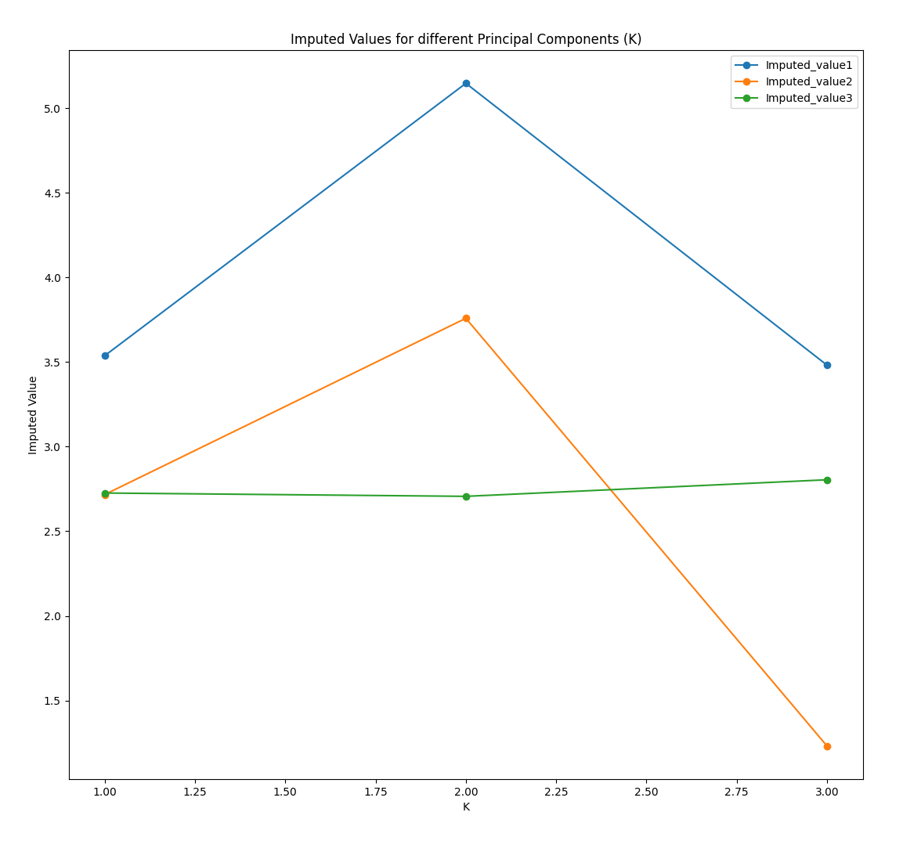
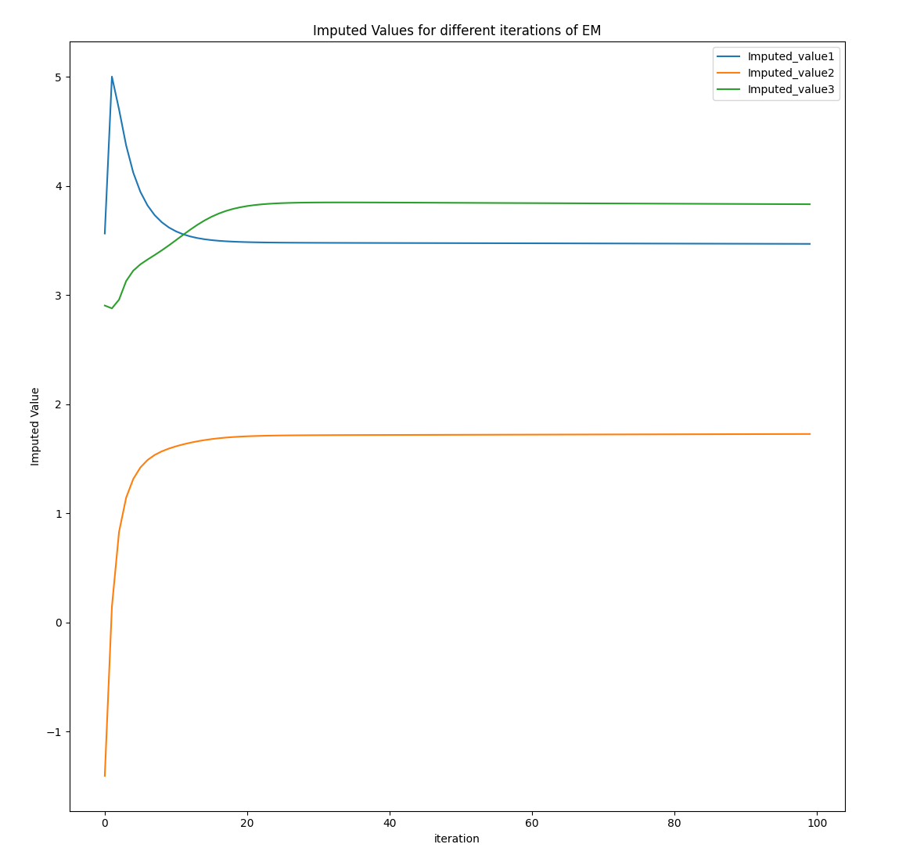
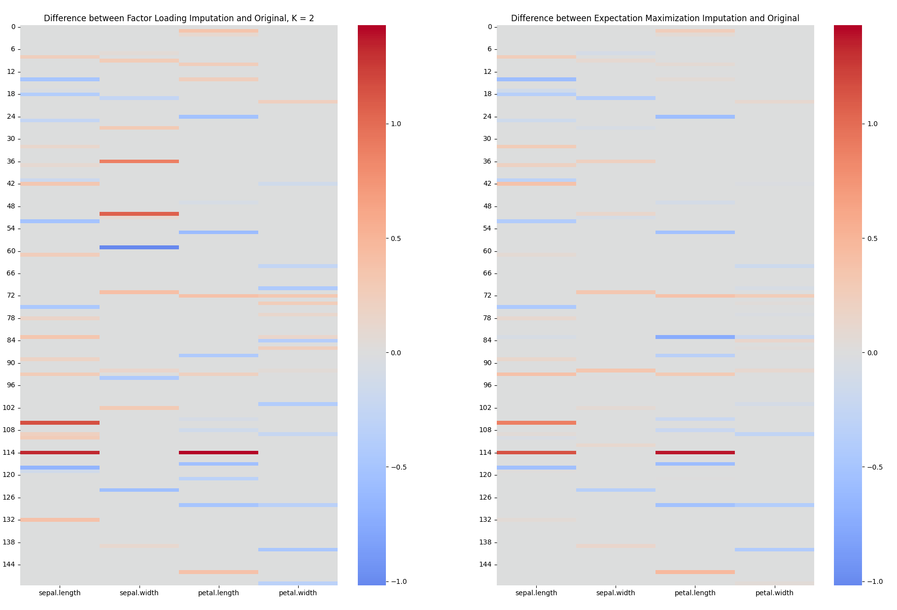

# Minimal Reproducible Example (MRE) for Replication Codes


## Introduction

This project aims to replicate the core imputation methods from the following papers:
- **Xiong and Pelger (2023)**: "Factors and Loadings"
- **Chen and McCoy (2024)**: "Expectation-Maximization for Missing Data"

The goal is to provide a minimal reproducible example (MRE) to demonstrate the implementations and results of these imputation techniques.

## Tested under:
- **Ubuntu**: 22.04.4 LTS
- **conda**: 23.9.0

## Setting Up the Environment

To create the environment for the minimal reproducible example (MRE), use the following commands:

```bash
conda create -n replication_env python=3.10
conda activate replication_env 
```

Once the environment is activated, install all the necessary Python packages:

```bash
pip install -r requirements.txt
```

For the development of both replication codes, a small dataset was used consisting of the following array:

```python
Data = np.array([
    [1.0, 2.0, np.nan],
    [2.0, np.nan, 3.0],
    [np.nan, 4.0, 5.0],
    [4.0, 5.0, 6.0]
])
```

### Observations

When running the snippets of code, you can observe how different values of K impact the results in the paper by (Xiong,Pelger). For the paper by (Chen,McCoy), you can observe the number of iterations until the EM algorithm converges (or diverges). Small plots are provided for each case:

### Comparing Imputers

We compare both imputers when used on the iris dataset with a MCAR (Missing Completely at Random) mask. In the end, we predict what the missing values would look like if we were able to observe them:

### Running the Files

To execute each file, use the following terminal commands:





Last, we compare both imputers when used on the iris dataset with a MCAR mask. in the end we try to predict what the missing values would look like if we were able to observe them. 



To run each file, we should use terminal commands: 

```bash
python Xiong_Pelger_2023_factors_and_loadings.py 
python Chen_McCoy_2024_ExpectationMaximization.py 
python main.py
```
